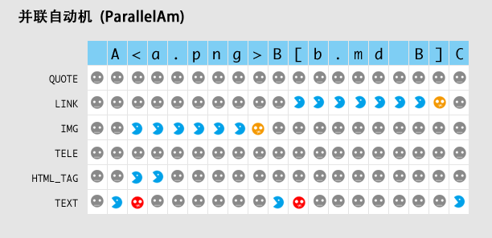

关于自动机
====
> 对于每个段落的解析，依靠自动机

### 自动机的状态转换图

* 自动机消耗输入的字符串
* 每次消费字符串，会导致自动机的状态发生改变
* 当状态为 `FULL_EAT` 或者 `FULL_REJECT` 的时候，自动机如果不被执行 `throwUp` 操作是不能再进食的
* 任何一个自动机， `DISREGARD` 状态必须都是相同的，即，只要恢复这个状态，就应该和初始状态一致

### 并联自动机

* 将多个自动机并列在一起，可多个自动机同时进食
* 大多数情况下，只会有一个自动机在进食
* 因为并联自动机需要一个停止符，所以并联自动机的状态并不可能是 `EAT_REJECT`

### 串联自动机

* 将多个自动机串联起来，同一时间只会喂食一个自动机
* 当所有的自动机都为 `FULL_EAT` 或者 `FULL_REJECT`，整个串联自动机才为 `FULL_XXX`
* 如果有一个自动变为 `DISREGARD`, 那么整个串联自动机就为 `DISREGARD`
* 如果变成 `DISREGARD` 则，串联自动机会调用 `throwUp` 恢复所有子自动机为初始状态

	